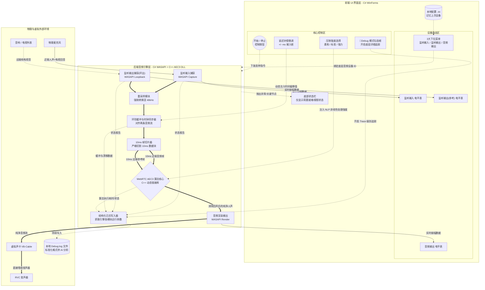

```mermaid
graph TD
    subgraph UI[前端 UI 界面层 - C# WinForms]
        Config[(本地配置 .ini\n记忆上次设备)] -.-> Dropdowns
        
        subgraph 设备路由区
            Dropdowns[3大下拉菜单\n监听输入 / 监听输出 / 音频输出]
            MeterIn[监听输入 电平表]
            MeterRef["监听输出(参考) 电平表"]
            MeterOut[音频输出 电平表]
        end
        
        subgraph 核心控制区
            ParamSupp[压制强度选择\n柔和 / 标准 / 强力]
            ParamDelay[延迟补偿微调\n+/- ms 输入框]
            ChkDebug[🐞Debug 模式勾选框\n开启底层详细追踪]
            Btn((开始 / 停止\n控制按钮))
        end
        
        LogBar[底部状态栏\n仅显示简要就绪/报错状态]
    end

    subgraph Core[后端音频引擎层 - C# WASAPI + C++ AEC3 DLL]
        CapIn[监听输入捕获\nWASAPI Capture]
        CapRef["监听输出捕获(环出)"\nWASAPI Loopback]
        
        Resample[重采样模块\n强制转换至 48kHz]
        
        Sync[环形缓冲与时钟同步器\n对齐两条音频流]
        Split[10ms 帧切片器\n严格切割 10ms 数据块]
        
        AEC3{WebRTC AEC3 算法核心\nC++ 动态链接库}
        
        Render[音频渲染输出\nWASAPI Render]
        
        LogWriter[结构化日志写入器\n抓取引擎各模块运行参数]
    end
    
    subgraph 物理与虚拟外部环境
        HW_Mic[物理麦克风]
        HW_Spk[音响 / 电视外放]
        VAC[虚拟声卡 VB-Cable]
        RVC[RVC 变声器]
        LogFile[(本地 Debug.log 文件\n标准化格式供 AI 分析)]
    end

    %% 控制流与日志流 (虚线)
    Btn -.->|下发启停指令| Core
    ParamDelay -.->|动态注入时间偏移值| Sync
    ParamSupp -.->|注入 NLP 非线性处理强度| AEC3
    Dropdowns -.->|绑定底层音频设备 ID| Core
    
    ChkDebug -.->|开启 Trace 级别追踪| LogWriter
    Core -.->|抛出异常/关键节点| LogBar
    CapIn -.->|状态报告| LogWriter
    CapRef -.->|状态报告| LogWriter
    Sync -.->|缓冲与漂移数据| LogWriter
    AEC3 -.->|算法执行耗时/状态| LogWriter
    LogWriter -.->|持续写入| LogFile

    %% 硬件到引擎的输入流
    HW_Mic -->|近端人声+电视回音| CapIn
    HW_Spk -.->|远端纯电视音| CapRef
    
    %% UI 电平表读取连线 (细线)
    CapIn -->|实时振幅数据| MeterIn
    CapRef -->|实时振幅数据| MeterRef
    Render -->|实时振幅数据| MeterOut
    
    %% 引擎内部高速音频流 (粗线)
    CapIn ==> Resample
    CapRef ==> Resample
    
    Resample ==> Sync
    Sync ==> Split
    
    Split ==>|10ms 近端音频帧| AEC3
    Split ==>|10ms 远端参考帧| AEC3
    
    AEC3 ==>|消除回声后的纯净人声| Render
    
    %% 引擎到外部的输出流
    Render ==>|纯净音频流| VAC
    VAC ==>|直接喂给变声器| RVC
```